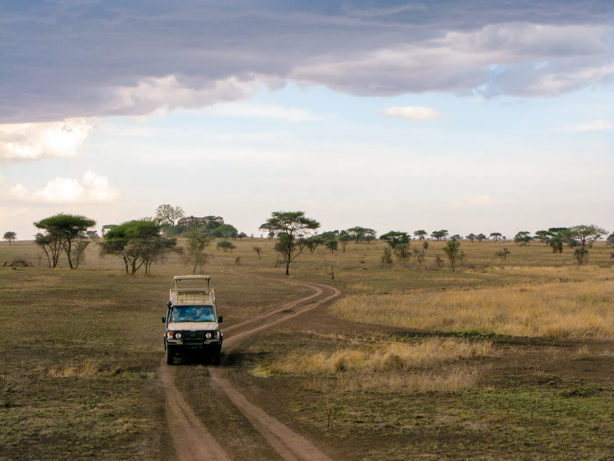

I remember, vividly, bouncing around in the back of a Toyota Land Cruiser as a thirteen-year-old boy, standing on the rear seat with my hands and face pressed to the dusty windows. Our driver and guide drove my family northward on an intensely corrugated dirt road into rural Tanzania, headed for the Serengeti. From the large sand-colored four-by-four, I watched animals of improbable shapes and sizes; wide savannas of grass, acacia, and baobab; great rock outcroppings that seemed to rise out of the earth like the backs of sleeping giants; and sunsets that set the enormous sky alight in red and orange. As we drove, I caught glimpses of men, women, and children with darker skin than I had ever seen, some wrapped in blankets of bright reds and blues, walking long paths to places I could not imagine.
It was around the year 2000. I was in middle school. My father was on sabbatical, and my parents had taken my sister and me to Tanzania for what was, in retrospect, one of several extraordinary trips I was lucky enough to experience as a child: long stretches abroad, many months sometimes, seeing the world together as a family. At the time, I did not think of these trips as expressions of class or privilege. They were simply the architecture of my childhood. There was our house, our ranch, our school, our dinner table, our family fights, our family vacations. There was the Black Hills of South Dakota. And then, suddenly, there was Africa.
I do not use that word casually now. Africa. It is too large a word to hold what I put into it then. But at thirteen, I did not know any better. I had no real categories for countries, histories, economies, ethnicities, colonialism, extraction, tourism, development, or power. I had only sensation. Dust. Heat. Scale. Color. The smell of diesel and dry grass. The slap and rattle of the Land Cruiser over washboard road. The supernatural patience of giraffes moving through thorn trees. The comic seriousness of wildebeest. The sudden electric appearance of a lion, impossibly near and indifferent to us. The long, fragile legs of flamingos in the shallows of Lake Manyara. The green bowl of the Ngorongoro Crater opening beneath us as if the earth itself had been scooped out by some divine hand and filled with animals.
We stayed in places that seemed, to me, indistinguishable from magic. In the Serengeti, there was a lodge built among kopjes, those ancient granite outcrops that rose from the plains like islands. At Ngorongoro, we slept on the rim of the crater, looking down into a world so complete and self-contained that I felt I had been given access to a secret model of creation. Near Lake Manyara, we stayed in what I remember as a kind of luxurious tent, though “tent” is probably too humble a word for a place with beds, staff, and dinner waiting nearby. Everything was arranged so that we could feel close to wildness without ever being endangered by it. We could sleep under canvas, but with beds. We could hear the night, but from inside. We could marvel at remoteness, then sit down to dinner.
I was dazzled by the otherness of it all. By landscapes that seemed impossibly vast, by animals I had previously known only from picture books and nature documentaries, by people whose lives appeared to me as mysterious silhouettes glimpsed through a moving window. The whole world seemed larger, stranger, and more alive than the one I had known. And perhaps that was part of the force of it. I had not always found it easy to feel at home in my own world. I was a restless, distractible, excitable child, prone to intensity, prone to fascination. In Tanzania, those traits were not problems. They were useful. My attention did not have to be narrowed, disciplined, made appropriate. It could run wild across the plains. There was always something to point at, something to ask about, something to stare at until it vanished behind us in a cloud of dust.
And then there were the people. I remember them much as I remember the animals and landscapes: as vivid pieces of the unfamiliar world unfolding outside the window. the lion under the tree, the elephant at the roadside, the giraffe moving like a slow hallucination across the plain, a woman carrying something heavy with remarkable poise, children walking beside cattle or goats, men standing in the shade near their bicycles — all became part of the same spell the journey cast over me. At thirteen, I absorbed these scenes more readily than I understood them. The people’s lives remained beyond my imagination, glimpsed only briefly before the Land Cruiser carried us on.
I do not know what those people thought of us. I do not know what the children who smiled or waved meant by smiling or waving. I do not know whether the lives I imagined from the back seat bore any relationship to the lives they were actually living. What I remember is my own perception: the thrill of difference, the sense of having entered a wider world, the almost physical pull of distance. I was a child in a protected vehicle, looking out.
At the time, these encounters did not yet organize themselves in my mind as “global health.” I did not look out the window and think about malaria, tuberculosis, maternal mortality, health systems, colonial history, or the grotesque arithmetic by which some lives are made safer than others. I was simply a child seeing people whose lives appeared unimaginably different from my own. But the raw materials were there: beauty, distance, apparent need, and my own unexamined impulse to convert what I saw into a feeling of purpose. I did not yet want to work in global health. I did not even know what global health was. But I was already learning, in the most emotionally potent way possible, to associate distant suffering with my own awakening.
I do not think I had ever been happier. Or, if happiness is too simple a word, I had rarely felt so awake. I felt as if some hidden part of me had been given permission to exist. The world was not boring. The world was not small. The world was full of danger and beauty and wonder, and I wanted, with the pure and uncomplicated appetite of a child, to be near it.
Twenty-five years later, I can see how much of my life began there. That trip propelled me, though not in a straight line, toward what would eventually become a career in global health. Four years at St. Olaf College, studying biology with a concentration in statistics. Three years in a master’s program in biostatistics at the University of Minnesota School of Public Health, focusing on epidemiology. Five years in a PhD program at Tulane, evaluating malaria programs. A postdoc in Amsterdam, studying subclinical tuberculosis and other problems that seemed both technically intricate and morally urgent. Tanzania, Uganda, Zanzibar, Ethiopia, Ghana, Zimbabwe, Zambia, South Africa. Conferences. Field visits. Journal articles. Research meetings. More Land Cruisers. More dusty roads. More earnest conversations in hotel lobbies, health facilities, conference centers, and airport lounges. More than a year, in total, spent on the African continent.
If you had told that thirteen-year-old boy, bouncing in the back of the Land Cruiser, that he would someday return to Africa again and again, riding in vehicles just like that one, working in research meant to help end malaria and tuberculosis, he would not have believed you. What a dream. What an astonishingly clean story it would have seemed. The boy sees the world, falls in love with it, studies hard, and devotes himself to helping.
Even less believable, to that boy, would have been the rest of it: that after attaining the dream, he would begin to question almost everything that led him there. That he would wonder whether the work he was doing was as much a part of the problem as the solution. That he would start to suspect that the good he might do over an entire career could be outweighed, or at least morally complicated beyond recognition, by the costs of doing it. That he would begin to feel alien in the very field to which he had devoted his ambition, education, and longing. That he would eventually ask whether his presence in global health was not noble, or useful, or even benign, but something closer to extraction with a clean conscience.
I did not know it then, but I was seeing Tanzania through the safest possible frame: glass, steel, petrol, money, itinerary, and someone else’s labor.

---

My own upbringing was far removed from the landscapes I witnessed through that window. I grew up in a large house on a cattle ranch in the Black Hills of South Dakota, just outside Rapid City. It is beautiful country: ponderosa pine, granite, cold creeks, enormous skies, and the particular kindness and suspicion of a place that believes deeply in self-reliance. My father’s work as an attorney ensured that I had all the amenities of life I did not yet know other people lacked. My mother, who had trained and worked as a psychiatrist before becoming a stay-at-home parent, made our home warm, structured, and safe. Dinner was not incidental in our house. We sat down together every night. My sister and I fought like cats and dogs, as siblings do, but beneath the noise there was love, loyalty, and the unspoken security of being held by a family that expected us to become something.
My life was comfortable. Privileged in a way I did not understand then and probably still do not fully understand now. We were white, affluent, educated, liberal in a deeply conservative place, morally serious in the way comfortable people are often morally serious: sincerely, selectively, and with very few consequences. We did not talk much about money because money did not need to be talked about. The mortgage, groceries, school, travel, doctors, college, the future — all of it existed in the background as something already handled. Someone cleaned our house each week. I did not learn how to do my own laundry until college. The absence of money anxiety was so complete that it took me years to notice it as an absence.
I had a strong sense of justice from an early age, or at least I experienced myself that way. I cared about animals. I cared about unfairness. I cared about suffering, especially suffering made visible to me in forms I could emotionally grasp. I wanted things to be right. I wanted good people to help. I wanted to be one of the good people.
The trip to Tanzania gave that desire a landscape. It did not, on its own, make me into a public-health researcher. It did something subtler and probably more powerful. It showed me a world that appeared, from my vantage point, to be more vivid than my own. More urgent. More beautiful. More wounded. More available to meaning. I did not yet understand that this was a dangerous way to see a place: as a stage on which my own moral life might unfold.
For years, the impression remained mostly dormant. In high school, I was more concerned with friends, grades, music, inside jokes, and the ordinary social weather of adolescence. I had memories of Tanzania and a hunger for a larger life, but I did not yet have a vocabulary for turning that hunger into a vocation.
College gave me the vocabulary. At St. Olaf, a private liberal arts college in Minnesota, I began as the kind of student who could plausibly imagine medical school. I had no scholarships. My parents paid for everything. Biology, pre-med, service, achievement: the path was convenient in almost every way. It pleased the part of me that wanted to be useful and the part that wanted to be admired. It also fit neatly into the story that had been forming beneath the surface. I wanted to work on suffering that seemed large enough to justify the size of my ambition.
Early in college, I read Tracy Kidder’s Mountains Beyond Mountains. The book follows Paul Farmer, and for me it landed with the force of scripture. Here was someone brilliant, morally serious, medically gifted, impatient with injustice, moving between American institutions and poor places with a kind of righteous intensity. I wanted the doctoring, yes, but not only the doctoring. I wanted the moral altitude. I wanted the proximity to suffering. I wanted the travel, the admiration, the story of sacrifice, the sense that one’s intelligence could be transmuted into justice if only it were pointed in the correct direction.
That is not a flattering sentence. It is also not the whole truth. My desire to do good was real. My outrage at poverty and preventable illness was real. So was the attraction to heroism. So was the wish to become impressive. So was the approval I imagined from parents, teachers, friends, and strangers who would hear what I did and recognize me as someone serious. The mixture is the point. The fantasy did not work because it was fake. It worked because every self-serving reward was braided together with something morally sincere.
I joined a campus group focused on development and poverty. I watched films and documentaries about suffering, conflict, disease, and heroic intervention: Hotel Rwanda, Blood Diamond, Invictus, The Constant Gardener. I read Paul Farmer, Jeffrey Sachs, Jared Diamond, William Easterly. I became drawn to the idea of an MD/MPH, then eventually to epidemiology and biostatistics, because health seemed like the cleanest moral territory. People might disagree about development, wealth, lifestyle, culture, modernity. But nobody wanted malaria. Nobody wanted tuberculosis. Nobody wanted a child to die because a bed net, a test, a medicine, or a functioning clinic was out of reach. Health let me imagine that I had found the universal doorway through which help could enter without condescension.
There were warning signs almost immediately.
During a study-abroad semester in Tanzania, I joined a few other students on a free week in Saadani. We spent time in the village. We met a fisherman on the beach, and he invited us to dinner with his wife outside their home. They shared food with us. I took photographs. One image showed the fisherman’s wife leaning against the outside wall of the house, looking downward. Later, back at St. Olaf, I used that image to promote a malaria event. I darkened the photograph. I made it look dreary and sad. I put the word “malaria” across it.
I do not know whether she had malaria. I had not asked her whether I could use her image in that way. I did not know her, not in any meaningful sense. She and her husband had shown us hospitality, and I had converted her into evidence.
At the event, Liz, a fellow student, asked about the ethics of the photograph. She was respectful and genuine. She was not grandstanding. I was at the podium, in front of the room, and I remember the hot onset of argumentative panic, the kind that comes when some part of you knows the question is valid and another part is scrambling to protect the story you need to tell about yourself. My defense was essentially that I knew the woman, so it was fine. But I did not know her. I had met her. The difference should have been obvious.
It was not a cinematic awakening. The poster disappeared after the event, but I spent days defending myself internally. I became more careful about photographing people over time, though not perfectly. Sometimes my desire for an image still overrode my judgment. That, too, matters. The point is not that I was corrected and became pure. The point is that the critique was available early, and I lacked the humility to receive it.
A few years later, I returned to Saadani with a grant to do a water project. The public version, still preserved in professional language, is clean: a student-led initiative, thousands of liters of rainwater storage, local stakeholders, sustainability, community engagement, proper maintenance. The remembered version is less clean. The village wanted piped water from elsewhere, which the grant could not fund. But before any genuine consultation, I had already decided that water was the problem I had come to address. We built a rainwater collection system at a school. Years later, my parents visited and reported that the system was in disrepair. I did not yet understand the pattern: I decided, I delivered, I left.
I used to think these early stories were embarrassing exceptions on the way to a more professional version of doing good. I see them differently now. They were not aberrations. They were rehearsals.

---

By the time I entered the PhD program at Tulane, the fantasy had become a life plan. I had given up on medical school and moved toward global health. I had a master’s degree in biostatistics. I could write code, build models, analyze surveys, and talk in the language of epidemiology. If the childhood trip had given the desire a landscape, and college had given it a moral script, the PhD gave it machinery.
I arrived bright-eyed. That is the only honest phrase for it. Going to Louisiana was itself another adventure, another chance to enter a new world, adapt quickly, and flourish inside it for a while. New Orleans felt unlike any American city I knew: humid, musical, damaged, alive, precarious, funny, haunted, and racially complicated in ways that were more visible than in the upper Midwest. There were swamps and bayous in the imagination around it, jazz on the street, people who talked differently, buildings that seemed always to be remembering weather, and a feeling that the ordinary rules of American life had been loosened by heat, history, and water.
The academic life thrilled me too. I was back in classrooms learning names for parasites, programs, pathogens, and methods: medical parasitology, helminthology, program evaluation, epidemiologic design. I was surrounded by people my age who cared about many of the same things, and by senior researchers at the top of their field. PhD life had its own rhythm of pressure and freedom: work hard, get tested, study in coffee shops, write code, read papers, drink with friends, meet people, listen to music, go to clubs, talk too earnestly about the world, sleep too little, and wake up believing the work still mattered.
The work seemed morally urgent and intellectually alive. It had just enough abstraction to suit my training and just enough field connection to satisfy the part of me that still wanted the Land Cruiser road, the heat, the project office, the sense of being close to something real.
Zanzibar was the apex of that life.
For three months during my PhD, I lived near Stone Town on Unguja, the largest island of the Zanzibar archipelago. For my PhD thesis, I was working on a malaria project evaluating reactive case detection, a surveillance strategy used in places where malaria has become rare enough that every detected case can trigger an investigation. When someone is diagnosed with malaria, teams visit that person’s household and nearby households, testing and treating infections they find. The premise is simple. The work is not. In a place approaching elimination, malaria becomes harder to see. It hides in low-density infections, in travel histories, in delays between diagnosis and follow-up, in the gap between the program as designed and the program as it actually unfolds.
Malaria in Zanzibar had not always been so rare. Parasite prevalence in the archipelago is described as historically high, with estimates as high as 68 percent among children ages one to six in the mid-1920s, and 35 percent as recently as 1988. After control efforts beginning in the early 2000s, incidence fell to less than three cases per thousand people in 2007, and later to a fraction of a case per thousand by 2015. I did not need exact death counts to feel the drama of that story. Zanzibar was beautiful, yes, almost extravagantly so, but it was also a place where malaria had once been ordinary enough to shape childhood, pregnancy, clinic life, and the background level of fear. The project let me imagine myself inside a success story still being defended.
I rented a room in a large house on the water for about twenty dollars a night. Every morning I woke near the sea and went to a project office near Stone Town. The other young people in the house were also there on the currents of international work and training, all of us living for a while inside the strange brightness of temporary purpose. One became someone I loved for a time. That matters because the life I had imagined was never only work. It was beauty, romance, independence, competence, foreignness, recognition, evenings in Stone Town, food, light on water, and the feeling that I had made a series of improbable choices and been rewarded with exactly the life I wanted. I did not yet know how much my faith in the work depended on loving the life that came with it.
Stone Town itself seemed built to reward getting lost. The streets narrowed and turned until finding anything felt like a small adventure, and then suddenly there would be a doorway, a carved balcony, a shop full of paintings or carved wood, a rooftop where the ocean appeared over the city and someone made the best mojito I had ever tasted. At night there were food markets, music, beachside bars, and the feeling of cultures folded into one another over centuries: African, Arab, Indian, European, Muslim, Christian, secular, tourist, local, ancient, improvised, commercial, intimate. The sunsets were indecently beautiful. The food tasted like movement across oceans. Everything seemed layered: empire, trade, religion, slavery, tourism, public health, ordinary life, my own temporary presence.
At the project office, I worked closely with Fakih, the field coordinator from Pemba who was central to the project. He was charismatic, technically sharp, warm, and unshowy. He knew the field realities, the team, the Ministry relationships, the logistics, the politics, the practical frictions that no protocol could fully anticipate. When problems came up, he helped solve them. Often he saw them before I did. I had statistical training and a position within the Tulane side of the project. He had forms of knowledge without which the project would have been fantasy on paper.
We also went to Pemba to help get the study rolling there. If Unguja was the Zanzibar of postcards and roof terraces, Pemba felt greener, quieter, less smoothed by tourism, and somehow more secret. We flew there in a small prop plane. I remember sitting up front near the pilot, with Fakih and other staff behind me, the water and islands below us, the project traveling not as a paper or an abstract but as people, bags, devices, forms, obligations, and expectation.
A Land Cruiser picked us up outside a small building that was the island’s entire airport. We drove over dirt roads through lush green hills, with the ocean appearing now and then in the distance. I remember the relief of leaving the tourist density of Unguja and entering a quieter setting that felt, to me, less arranged around visitors and therefore more adventurous. That feeling was partly projection, I know, but it was powerful. At the hotel, the power and hot water were out, so Fakih guided us to a local restaurant. The available food sat behind glass at the counter and a grey parrot watched from a small rusted cage, like the accidental mascot of the place. In the morning I sat on the balcony of my hotel room with coffee, looking across green hillsides toward the ocean, and felt the old childhood spell renewed in adult form.
That was what made Zanzibar so intoxicating: the whole package, not the scenery alone and not the work alone. The place was gorgeous, the project was serious, the colleagues were capable, and the problems were practical in the best way. We were not only writing grant language about capacity and collaboration. We were trying to make a complicated system work in a place where the stakes were visible, even when the infections were not.
At the time, I mostly experienced the good version of my career. I had chosen a path in life, and Zanzibar confirmed the choice. I was not merely reading about global health anymore. I was living inside it. The boy in the Land Cruiser had returned as a PhD student with a laptop, a protocol, a project office, collaborators, a role, and a reason to be there. It felt like arrival. It felt like proof.
Before the curtain fell, I enjoyed it. I enjoyed being treated as someone whose presence mattered. I enjoyed feeling useful. I enjoyed being able to tell people at home that I worked on malaria in Zanzibar. I enjoyed the pride my parents felt. I enjoyed being someone who had made it from South Dakota to this world of conferences, project offices, field teams, ministries, and long flights.

---

The School Net Programme was less romantic than Zanzibar, which is why it may matter more. It was the global-health machine in ordinary motion: a useful malaria intervention, field teams, survey forms, training, data quality, a publication, and a young researcher sent to help keep the science intact. It also contained what would later trouble me: the hotel, Land Cruiser, front seat, authority, household interviews, and other people’s labor converted into data and career capital.
The program evaluated school-based distribution of insecticidal nets in southern Tanzania. The study surveyed more than five thousand households and found increased net access and use, but also that the program tended to reach wealthier families with children enrolled in school. It was useful work, and its limitation mattered: even an effective delivery system can reproduce inequality through the ordinary fact of who is reachable.
In 2016, after several flights — including an absurdly contrasting free upgrade to business class — I arrived in Mtwara. A Land Cruiser took me to a modest visitor’s hotel. I was still a student. My role was to troubleshoot survey forms and tablets, help with training and startup, and answer questions about the data. That had real value. A bad skip pattern can erase information; a confusing question can turn a household’s time into unusable data. Making data count is one way of respecting the people asked to provide it.
Yet something else was happening at the project table. I was often the only white person in a room of Tanzanian leaders and field staff who knew far more about the places where the study would occur. They listened when I explained the survey logic. Some attention was warranted by my role; some felt disproportionate. I came from the institution linked to the funding, analysis, and eventual paper. I felt that before I understood it.
Several Land Cruisers took teams into study areas. I was usually invited into the front passenger seat while more experienced Tanzanian staff sat in the back. It seems too small to mention, except that power often lives in small arrangements: who sits in front, who drives, explains, translates, observes, is introduced as the visitor, and later disappears into the phrase “field team.”
We visited households to test forms and observe interviews lasting ninety minutes or more. I stood back to keep my presence from dominating. That felt respectful and absurd. If my presence had to be managed like a disruptive variable, what was I doing there?
The answer seemed easy: helping the science work. The project could improve net distribution; evidence could improve policy; children might be protected.
That answer was not wrong. It was incomplete.

---

No honest account can pretend global health is a hollow performance. At its best, it saves lives, reduces suffering, strengthens health systems, pays salaries, generates knowledge, changes policy, and makes treatment and prevention possible where disease burdens are high and resources constrained.
The moral problem would be easier if the work were useless. But malaria, tuberculosis, HIV, maternal mortality, and other preventable causes still kill millions. At the same time, under-five mortality has fallen dramatically, immunization has saved well over a hundred million lives, HIV treatment reaches tens of millions, and malaria and TB programs have prevented deaths on a vast scale. The estimates are modeled, but they are not propaganda. They are why the field remains morally serious even when its structure deserves scrutiny.
Most achievements look less like dramatic rescue than competent delivery: vaccines kept cold; nets procured, shipped, distributed, used, and replaced; TB patients found, diagnosed, treated, supported, and recorded. Science matters, but so do fuel, refrigerators, roads, stock rooms, district meetings, community health workers, and data systems. The work is lifesaving and morally entangled because delivery requires systems, and systems distribute power.
My own work had possible value. The School Net Programme asked whether a delivery mechanism worked, whom it reached, and whom it missed. My TB research combined national prevalence surveys to study subclinical disease that exists beneath obvious symptoms, perhaps helping the field see a quieter part of the epidemic. I advocated, in a limited way, for Fakih to have an opportunity to pursue a PhD. If he completed it, the achievement was his; his intelligence and work belonged to him. Yet even that positive story raises a structural question: why should his opportunity have required facilitation through institutions and relationships in the Global North? A success can reveal the failure that made it necessary.
Global health depends on people whose names rarely lead papers: clinic staff, community health workers, laboratory technicians, nurses, drivers, data collectors, district teams, ministry officials, local scientists, participants, and patients. They know how to explain a question, keep a cold chain functioning, navigate a road after rain, recognize a tired respondent, protect a sample, or predict why a policy will fail in one district and work in another.
Researchers and donors from wealthy countries contribute money, methods, technology, and connections, sometimes with enormous value. Yet the field’s stories place the grant, model, paper, conference presentation, and visiting expert at the center. Local knowledge and implementation become scenery, even when they make the work possible. I benefited from that storytelling.
The deeper question is who defines the problem, controls the money, owns the data, determines success, absorbs the risk, becomes evidence, builds a career, and leaves when the project ends. The good is real. So are the structures governing who can convert that good into comfort, authority, identity, and future opportunity.
Once I accepted both truths, ordinary objects — the vehicle, hotel, and per diem — no longer looked like background.

---

For years, the Land Cruiser made me feel important.
It was imposing, tank-like, unmistakably associated in my mind with safari, aid, development, global health, official movement across rough roads. In childhood, it carried my family safely through Tanzania, allowing us to feel near wildness while remaining protected from it. Professionally, it carried me into field sites, villages, clinics, trainings, households, district offices. Often, an African driver sat beside a white visitor. Often, I was that visitor.
The vehicle arranged the social geometry of the work before anyone spoke: mobility, protection, race, money, institutional authority, local labor, and outsider access in one machine. From inside, I saw the world I believed I was entering. From outside, the view may have been a large vehicle bearing an organization’s sticker, driven by a Tanzanian employee and carrying a visitor toward people who would be asked to receive him.
The metaphor should not erase practical reality. Roads were bad, distances long, and drivers skilled. Fieldwork required reliable transport. Logistics are how work happens. But logistics also reveal who moves and who waits, who arrives and who receives, who leaves at day’s end and who lives where the project occurs.
Hotels revealed similar arithmetic. During the School Net Programme, I received travel allowances that greatly exceeded everyday local costs. I could return from a trip with much of the per diem unspent; after Zanzibar, I remember bringing home thousands of dollars. Even my underpaid American graduate-student life belonged to a different economy from the one surrounding the hotel and fieldwork.
Visitor hotels were built for consultants, NGO staff, researchers, tourists, and others with passports, expense accounts, and expectations of security, hot water, Wi-Fi, and rest. Local workers made that comfort possible for salaries that could amount to a fraction of one visitor’s nightly room rate. Comfort is not inherently wrong; projects require lodging and rest. What unsettles me is how easily I treated it as neutral background, when it was among the clearest signs of whom the system was built to receive.
The more I looked, the more the old clean story came apart. I had wanted to step out of the Land Cruiser and be with the world beyond it. Instead, I began to see that much of my career had consisted of learning how to look out more professionally.
The first cracks in my clean story were easy to justify. A front seat reflected my technical role. A hotel ensured safety and productivity. Flights were necessary for in-person work. Publications served science. Salary gaps followed labor markets. Per diems followed policy. Northern institutions managed grants because donors required compliance.
No single thread undid me. It was the whole fabric.
In 2019, I traveled alone to Zimbabwe for a short consultancy evaluating a US-funded malaria program. I stayed at a beautiful, white-owned lodge in Harare, with immaculate grounds and a colonial style almost too obvious for questions I had not learned to answer. Each day a Land Cruiser carried me to meetings with senior malaria officials. At one point, I visited the heavily secured home of an American professional with a long career in Africa. I do not mention this to indict him; I recognized the arrangement because I was inside it.
We were outsiders doing public-health work in a country marked by economic crisis and a rational distrust of visitors who arrived, collected data, and left with professional benefit. I was there to evaluate a program intended to prevent malaria. I was also another outsider taking information away.
During my Amsterdam postdoc, I became more aware of budgets, authorship, and agenda-setting. Donors and principal investigators met in Europe or the United States. Funding calls defined priorities. Northern institutions held primary grants and administrative authority. African partners contributed expertise, access, implementation, and legitimacy, yet formal control often remained elsewhere.
Visits to institutions in Ghana and Uganda made the asymmetry concrete. I met leaders and researchers with deep contextual knowledge, strong ideas, skilled staff, and long institutional memories. Yet money and authority often reached them through institutions like mine. They did not lack expertise. They lacked a position in the funding architecture that allowed their expertise to control the terms.
My motivation collapsed. For me, that is not a minor inconvenience. I need to believe, at least at some basic level, that the thing I am doing is good. As the doubts accumulated, the old fuel disappeared. I kept pushing. I complained. I became numb. I began to feel, in my worst moments, like a villain: someone mining Africa for data and experience, converting other people’s illnesses, labor, and institutional constraints into my own publications, salary, identity, and stories.
For a while, I understood that shift as a simple moral awakening. I had seen the structure clearly, and once I had seen it I could no longer unsee it. That story contains truth. It also flatters me.
There is another possibility I have to consider, one less flattering to my current self than the story I have told so far. Perhaps I did not leave global health simply because I finally saw it clearly. Perhaps I also became able to see its compromises because the life itself had stopped giving me what it once had.
The structural problems I have described were not new. The money had always flowed unevenly. Global North institutions had long held disproportionate power over grants, publications, and careers. I had always stayed in hotels and ridden in project vehicles. The field had not suddenly become morally compromised during my postdoc. What changed was me.
I was older. The adventure had become work. The first trip to Zanzibar had contained almost everything I wanted from life at that age: purpose, romance, beauty, independence, intellectual excitement, recognition, and the intoxicating sense that I had escaped the ordinary. Years later, another project meeting was another project meeting. Another trip meant airports, expense forms, a hotel room, a presentation, emails waiting when I returned. The field that had once made the world feel larger had acquired deadlines, budgets, institutional politics, papers I did not want to write, and hours at a computer.
I was also burning out. I do not know how much weight to give that fact. Burnout can sharpen moral perception; it can also darken it. A person who is exhausted may finally stop accepting compromises he once rationalized. He may also begin to experience ordinary frustrations as evidence that the whole enterprise is rotten. Both can be true at once.
This leaves me with an uncomfortable question. Did I become disillusioned because I finally understood the system, or did I become willing to indict the system because it had stopped rewarding me?
I cannot answer that cleanly. I suspect the answer is both.
There is vanity available in disillusionment too. First I had imagined myself as one of the good people, the American researcher who had crossed the distance and devoted himself to suffering that mattered. Later, I risked replacing that flattering identity with another: the person perceptive enough to see through the whole arrangement. The hero can become the critic without ever surrendering the center of the story.
That possibility does not make the criticism false. A grant does not become more equitably controlled because I was burned out when I noticed who controlled it. A salary gap does not disappear because I missed being young in Zanzibar. The distribution of money, authorship, authority, and mobility can be examined independently of my mood. But my account of how I came to see those things cannot.
Perhaps the hardest thing for me to admit is that I did not only lose faith in global health. I lost a version of myself. The boy who had looked through the Land Cruiser window had grown up and, improbably, entered the world he had imagined. For a while, that world gave me nearly everything I had asked of it. Then it became a job, and I became a person for whom the job no longer worked. I still do not know how much of my moral awakening was awakening, and how much was grief.
That feeling is not a verdict. I do not know that my net effect was negative. I do not know that the work I did was harmful overall. In fact, I suspect some of it helped. But the suspicion that my career might not be the clean good I had imagined was enough to collapse the identity built around it.
Eventually I left. Not entirely, not cleanly, but enough that the life I had imagined for myself fell away. The field I had pursued out of love and ambition no longer felt like a place I could inhabit innocently. I moved into other statistical work. I burned out again. I found myself outside the world that had given me purpose, status, friends, travel, romance, intellectual excitement, and a story about who I was.
I missed it immensely. I still do.
That longing matters. It keeps the critique from becoming too clean. I miss global health. I miss the people, many of whom are genuinely wonderful. I miss conference days ending in bars or karaoke, the shorthand of shared work, the feeling of belonging among people who care about malaria diagnostics or TB prevalence or program evaluation with a sincerity that would bore most dinner parties. I miss Africa, though even writing that sentence makes me nervous because it risks turning a continent into a private emotional resource. What I mean is more specific and less defensible: I miss the places, roads, project offices, coastlines, hotel rooms, conversations, meals, field days, and states of attention I came to associate with work there. I miss the feeling of being fully in the world. I miss the person I was allowed to believe I had become.
Leaving did not solve the moral problem. It only removed me from one version of it, and gave me a new vantage point from which to be tempted by certainty.

---

Part of what troubles me now is how eagerly the institutions around me made the role I wanted feel not only possible but virtuous. Not against my will. I wanted it. But wanting is shaped. Desire has teachers.
By the time the fantasy became professional, its teachers were no longer only books, movies, charity events, and celebrity philanthropy. They were also admissions committees, fellowships, conferences, publication lists, grant applications, institutional websites, and the approval of people I respected. The field did not merely tolerate my longing to be useful. It gave that longing a career path.
That is not an alibi. Institutions shaped my desire, but they did not erase my agency. I chose the applications, the trips, the projects, the professional story. I accepted the rewards when they came.
I do not mean that the admiration attached to global health is always undeserved. Many people in the field work very hard. Many are underpaid relative to what they could earn elsewhere. Many are motivated by profound commitments. Many spend careers inside problems that would be easier to ignore. But the field also offers a powerful identity package to people like me: intelligence plus compassion, travel plus seriousness, technical skill plus moral meaning, personal adventure plus public virtue.
It is a seductive package because it contains enough truth to resist easy cynicism. It can also survive disillusionment. The field can reward the person who believes in the mission and, in subtler ways, the person who has learned to critique it. There is professional and personal dignity available in both positions.
Global health is financed through a mix of domestic government spending, development assistance, private philanthropy, research grants, and large disease-focused mechanisms. WHO sets norms, issues technical guidance, coordinates surveillance standards, and convenes countries, but it is not mainly a giant service-delivery agency. The Global Fund moves billions of dollars into HIV, TB, and malaria programs. PEPFAR, created by the United States, transformed HIV treatment access in many countries. Gavi helps finance vaccines and immunization systems. The Gates Foundation funds research, product development, data systems, advocacy, and delivery. Universities and nonprofits write proposals, manage grants, subcontract partners, analyze data, publish papers, and supply expertise.
At the global level, health spending is vast but profoundly unequal. Low- and lower-middle-income countries together contain roughly half the world’s population and a large share of the disease burden, but only a small fraction of global health spending. Development assistance for health is much smaller than total health spending, but for particular programs — HIV treatment, malaria control, TB services, vaccination, emergency response — external financing can be decisive. That is the practical argument for global health funding. It is also where the power problem begins.
The public language is almost always beautiful. Collaboration. Capacity building. Empowerment. Sustainability. Stakeholder engagement. Evidence-based intervention. Locally informed implementation. Data-driven decision-making. Health systems strengthening. These phrases are not meaningless. Sometimes they describe real work. Sometimes they describe aspirations. Sometimes they are the ritual language by which unequal arrangements become institutionally acceptable.
I have written that language. I have benefited from it. I have described projects as collaborative when the collaboration was real but bounded by funding structures I did not challenge. I have described capacity building while knowing that the career capital of the project still flowed disproportionately toward the Global North. I have described sustainability in a public profile for a water project that, in my own memory, had no serious maintenance plan. I have written about translating findings into actionable insights while knowing that the publication itself was the action most legible to my career.
Publication added its own machinery. Data flowed from households, clinics, field teams, partner institutions, and local expertise into analyses and papers. I did real work. Analysis and writing are labor. But academic credit has a way of concentrating around the people positioned to write the primary papers, speak at conferences, and translate field realities into the language journals reward. Norms can be reasonable inside a system that is not. Who gets the training that counts? Who gets paid to write? Who has English publication fluency? Who can afford to spend months turning other people’s practical knowledge into academic capital? Who is thanked in the acknowledgements?
None of this makes me uniquely bad, or uniquely clear-sighted now. That is the problem. The system does not require unusually cynical people. It works perfectly well with sincere people who learn the grammar.
The recent language of decolonizing global health has, for me, been both necessary and inadequate. By that phrase, I mean a broad critique and movement within the field that asks global health to confront its colonial history and present-day hierarchies, and to shift power over money, agendas, authorship, leadership, data, and institutions toward the countries and communities most affected by the problems being studied. Necessary because the field’s colonial residues are not subtle: money, agenda-setting, institutional prestige, authorship, who gets to travel, who gets to host, who gets to speak, who gets to be called a partner, who gets to be called local. Inadequate because language can move faster than power. A panel can be diversified while the grant remains controlled elsewhere. A paper can include local authors while first and last authorship still map onto old hierarchies. A proposal can say “locally led” while the budget authority, compliance burden, and conceptual frame remain in Europe or the United States.
Historically, donors have had real reasons for routing funds through Global North institutions, including risk management, compliance requirements, administrative capacity, and fears about corruption or misuse. I do not know the right answer to that problem. Corruption exists. Administrative capacity matters. Fiduciary responsibility is real. Funders cannot simply wire millions of dollars into any institution with a morally compelling claim. But risk management can also become a permanent excuse for withholding control. If African institutions are capable enough to implement the work, recruit participants, collect data, host visitors, manage field teams, and lend legitimacy, at what point are they capable enough to hold the money?
The answer will not be as simple as “from here, not there.” Representation itself is difficult. A national research institute may be closer to the work than a European university but still far from the poorest households affected by a program. A Ministry may have mandate but not always trust. A local NGO may know the community but lack administrative capacity. A community leader may not represent women, migrants, youth, patients, or the poorest residents. A diaspora scientist may understand both systems and belong uneasily to each. “Local” is not magic. “Community-led” is not self-defining. But the difficulty of defining legitimate representation should not be used to preserve the convenience of existing control.
The question I keep returning to is not whether people like me can ever contribute. I hope we can. I think we can. Money from wealthy countries should move toward health needs in poorer countries, especially when the wealth of those countries is historically entangled with extraction, domination, and unequal exchange. Technical knowledge should be shared. Institutions should collaborate. Disease does not respect borders, and neither should moral concern.
But transfer is not the same as control. Giving is not the same as empowering. Describing a project as collaborative is not the same as asking who could say no, who could redirect the funds, who could define success, who gets paid, who gets promoted, who gets authorship, who gets invited to the meeting where the idea is born, who is still there when the visitor goes home.
The field taught me to ask whether a project would save lives. I still believe that question matters enormously. I no longer believe it is enough.

---

I want to return to global health. That may be the most morally suspicious sentence in this essay.
I want to return because the work matters. Malaria, TB, HIV/AIDS, neglected tropical diseases, maternal health, child health, health systems, and implementation still matter. I have skills that may be useful. I miss the people, the purpose, the sense of belonging to work that seemed larger than myself. Global health is not only my profession but part of my identity, and I do not know how to amputate it cleanly. Africa, or the parts of it I have known, still holds a large part of my heart, even if that heart is full of projection, privilege, longing, and unfinished ethical work.
The fact that I can name the wish does not purify it. I am not entitled to return simply because I miss it.
If I return, I want the work to meet a higher threshold than my old dream required. I want direct and clear benefit proportionate to the budget. I want the people and institutions closest to the work to have genuine control, not just advisory status. I want primary grantee status, agenda-setting power, authorship, leadership, and budget authority to shift toward the countries and communities the work is supposed to serve. I want global-health jobs for people like me to exist only where they add something specific, accountable, and wanted, not where they preserve our need to feel useful. I want to know whether my salary, travel, and institutional position produce more good than they consume. I want to ask whether the project exposes a system, exposes me, or merely exposes someone with less power.
These are aspirations, not answers. Each one opens another question. What counts as direct benefit? Which institution represents a community? What if local elites capture resources? What if external money genuinely saves lives faster than a slower transfer of control? What if lives saved today and power transferred tomorrow are both necessary, but the system always uses the first to postpone the second?
This is where I get stuck. The chain of reasoning becomes too long. Every thread leads to another knot. My sense of justice will not let me happily continue as before. My uncertainty will not let me declare the field illegitimate and walk away clean. My longing will not let me pretend the question is abstract. I cannot prove that my participation has been net harmful. I cannot prove that it has been net good. I do not know which question to answer first.
Still, silence would be easier and less honest. The clean story I once told myself no longer holds. I suspect many people in and around global health know some version of this discomfort and have learned to manage it privately, with better language, better caveats, better panels, better acknowledgements, while the structure mostly persists. I do not want the next thirteen-year-old in the back of a Land Cruiser, or the next college student reading about Paul Farmer, or the next PhD student glowing at the first invitation to present, to inherit only the fantasy.
I also do not want to take the fantasy away entirely. Wonder matters. Moral desire matters. The wish to help is not contemptible. The world should be full of people who are moved by preventable suffering and willing to organize their lives around reducing it. The danger is not the desire to do good. The danger is the ease with which that desire can be made compatible with keeping power.
The Land Cruiser is still the image I cannot shake. At thirteen, I pressed my face to the dusty glass and thought I was seeing the world. Later, I sat in the front seat as a global-health researcher and thought I had returned differently. I had more language, more purpose, more responsibility, more knowledge. But the frame around me had not changed as much as I wanted to believe.
I used to imagine the ethical goal as stepping out of the Land Cruiser, leaving the protection and insulation of the vehicle, becoming more genuinely present in the places I visited, less buffered by glass, steel, money, race, passport, institutional affiliation, and the ability to leave. Now I am not sure the image is that simple. Some forms of protection travel with me whether I want them to or not. I may never truly understand, or belong to, the world on the other side of that steel and glass. Sometimes stepping out is necessary. Sometimes the vehicle should be driven by someone else. Sometimes I should not be on the trip. Sometimes the work requires the vehicle, but the route, budget, passengers, purpose, and ownership should be decided elsewhere.
The first honest step may be to stop pretending the frame is not there.
For now, I remain inside the question. The engine is off. The door is open. I am looking at the road ahead and at the seat I have occupied for so long, trying to understand who should be driving, who chose the destination, who paid for the fuel, and why I ever mistook the view from my window for the whole world.
